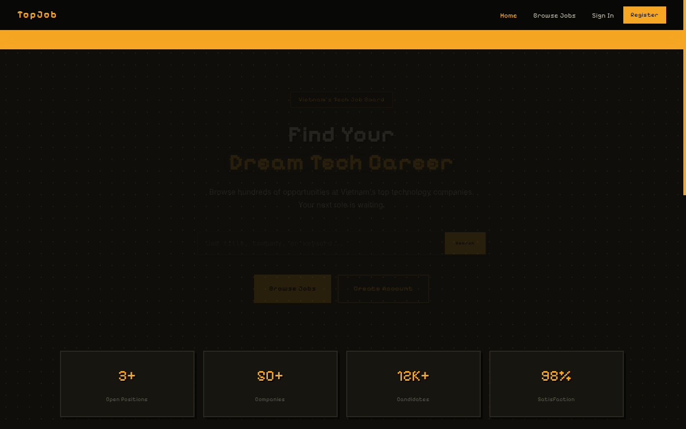
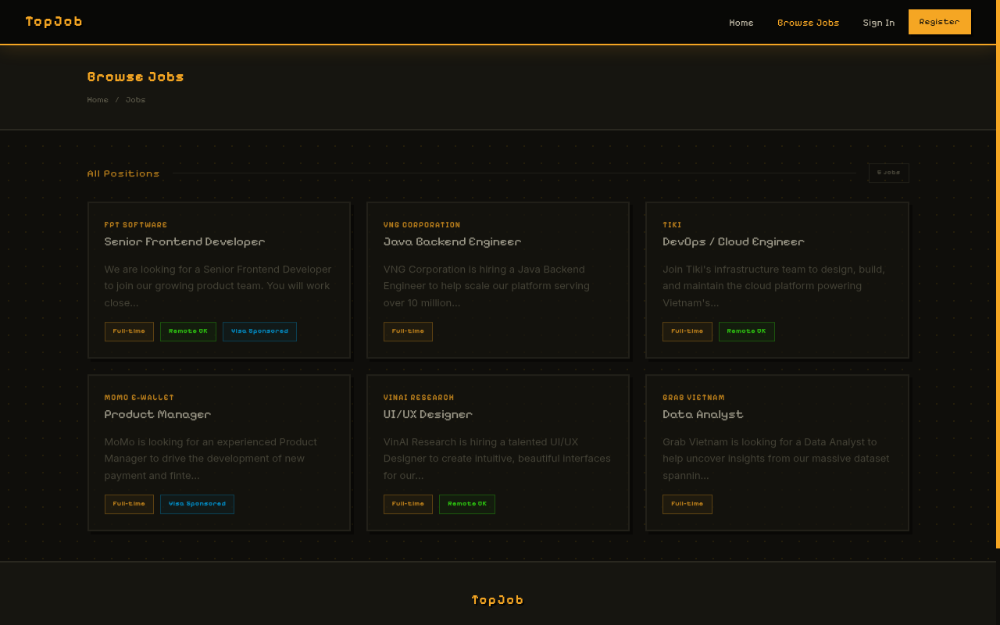
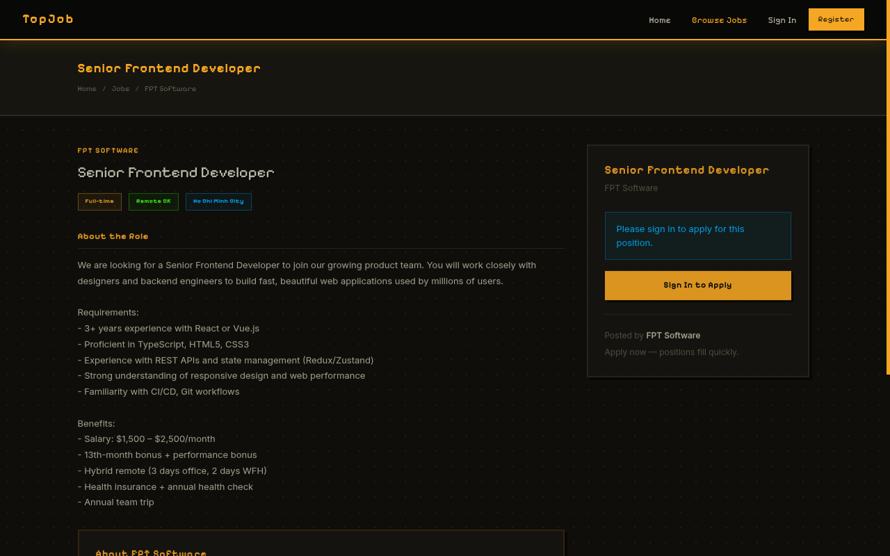
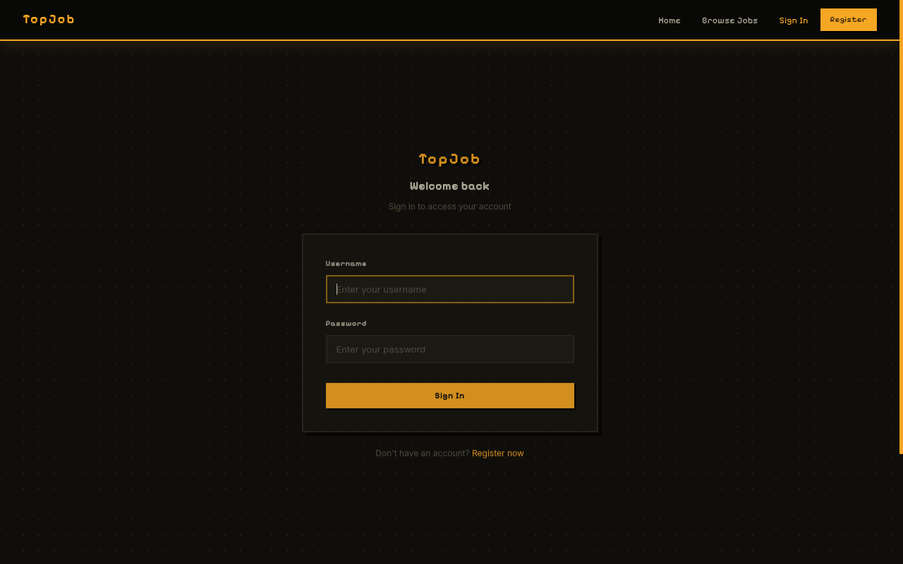
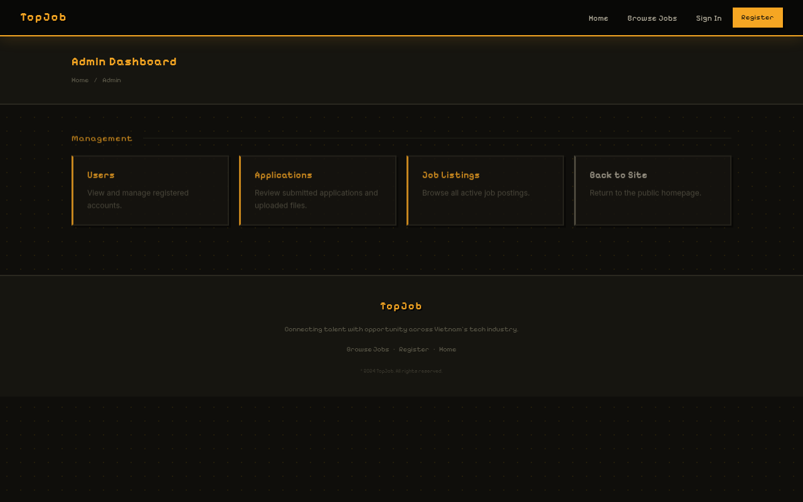

# TopJob — Vulnerable Web Application

A deliberately vulnerable job search web application built for **security learning and CTF practice**.  
The site looks and feels like a real job board (TopCV / CareerBuilder style), but contains **6 intentional OWASP Top 10 vulnerabilities** hidden in the codebase — no warnings, no hints in the UI.

> **For educational use only.** Deploy in isolated/local environments.

---

## Screenshots

| Homepage | Browse Jobs |
|----------|-------------|
|  |  |

| Job Detail | Sign In |
|------------|---------|
|  |  |

| Admin Dashboard |
|-----------------|
|  |

---

## Tech Stack

| Layer | Technology |
|-------|-----------|
| Backend | Java 17 · Spring Boot 3.3 · Spring MVC · Spring Data JPA |
| Frontend | Thymeleaf · CSS (Pixelify Sans · Inter) |
| Database | MySQL 8.0 |
| Runtime | Docker · Docker Compose |

---

## Quick Start (Docker)

```bash
# Clone the repo
git clone https://github.com/vutiendat323/job_search_vulnerabilities.git
cd job_search_vulnerabilities

# Start everything (MySQL + Spring Boot)
docker compose up --build -d

# App is ready at:
open http://localhost:8080
```

> First startup takes ~60 seconds for MySQL to initialize and the app to seed data.

To reset the database (fresh seed):
```bash
docker compose down -v
docker compose up --build -d
```

---

## Default Accounts

| Username | Password | Role |
|----------|----------|------|
| `admin` | `admin123` | ADMIN |
| `alice` | `password123` | USER |
| `bob` | `iloveyou` | USER |
| `charlie` | `hunter2` | USER |

---

## Vulnerabilities

Six OWASP Top 10 vulnerabilities are hidden in the application.  
Try to find them yourself first — spoilers below.

<details>
<summary>Show Vulnerabilities (Spoilers)</summary>

### #1 — Broken Access Control (A01:2021)
`/admin`, `/admin/users`, `/admin/applications` require **zero authentication**.  
Any unauthenticated user can access the admin panel by navigating directly to the URL.

**File:** `AdminController.java` — no `@PreAuthorize` or session check.

---

### #2 — IDOR — Insecure Direct Object Reference (A01:2021)
`GET /admin/users/{id}` returns **any user's full profile** by changing the numeric ID.  
No ownership check exists.

```
/admin/users/1  →  admin account
/admin/users/2  →  alice
/admin/users/3  →  bob
```

---

### #3 — Cryptographic Failure — Plaintext Passwords (A02:2021)
Passwords are stored and compared as **plain text** — no BCrypt, no salt.  
Visible in the admin users table at `/admin/users`.

**File:** `UserService.java` — `user.getPassword().equals(password)`

---

### #4 — Unrestricted File Upload (A04:2021)
`POST /jobs/{id}/apply` accepts **any file type** with no extension validation.  
Files are saved with their original filename to `src/main/resources/uploads/`.

A `.jsp` webshell uploaded here could lead to **Remote Code Execution** on a permissive server.

**File:** `ApplicationController.java` — no MIME or extension check.

---

### #5 — Unauthorized Write — Missing Auth on Job Creation (A01:2021)
`POST /jobs/create` has **no session check**.  
An unauthenticated attacker can create job listings:

```bash
curl -X POST http://localhost:8080/jobs/create \
  -d "title=Hacked&company=Evil&description=Owned"
```

**File:** `JobController.java` — `createJob()` never checks `session.getAttribute("user")`.

---

### #6 — Mass Assignment (A04:2021)
`POST /register` binds **all request parameters** to the `User` object, including `id` and `role`.  
Sending `id=1` in the POST body overwrites the admin account:

```bash
curl -X POST http://localhost:8080/register \
  -d "id=1&username=hacker&password=pwned"
```

**File:** `UserController.java` — Spring `@ModelAttribute` maps every param including `id`.

</details>

---

## Project Structure

```
src/
├── main/
│   ├── java/com/example/jobsearch/
│   │   ├── controller/         # MVC controllers (vulnerabilities here)
│   │   ├── model/              # JPA entities
│   │   ├── repository/         # Spring Data repositories
│   │   ├── service/            # Business logic
│   │   └── DataInitializer.java  # Seeds DB on startup
│   └── resources/
│       ├── static/css/         # Stylesheet (Pixelify Sans retro theme)
│       ├── templates/          # Thymeleaf HTML templates
│       └── application.properties
├── Dockerfile
└── docker-compose.yml
```

---

## License

MIT — built for learning purposes.
